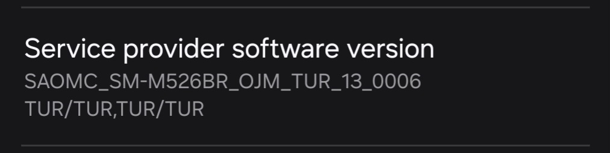

# Modem and bootloader repository
**for Samsung Galaxy sm7325 devices**

To [download](https://github.com/saadelasfur/proprietary_vendor_samsung_sm7325/releases) the correct binaries for your firmware, check your device's model number and your current OMC sales code (ex. M526BR**OJM**7CYE1):

### Credits
- [@jesec](https://github.com/jesec) and [@corsicanu](https://github.com/corsicanu) for the original GitHub Actions script.
